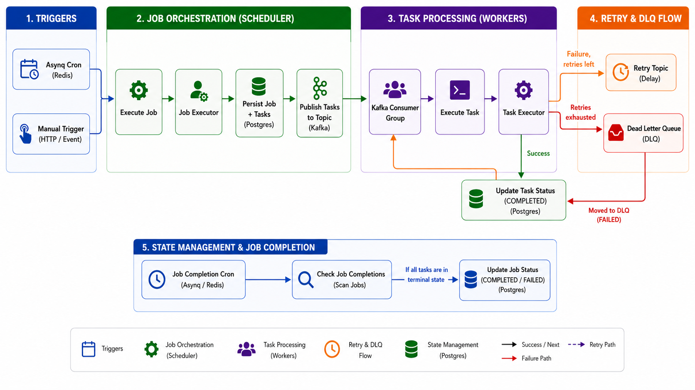
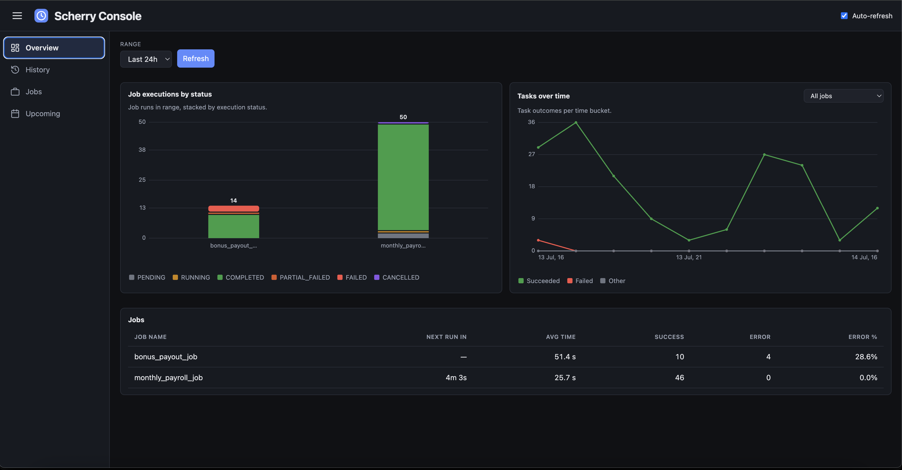
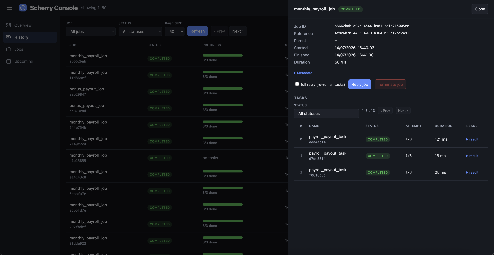
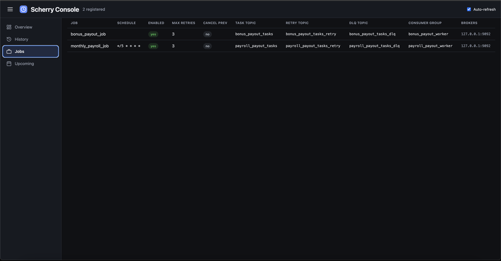
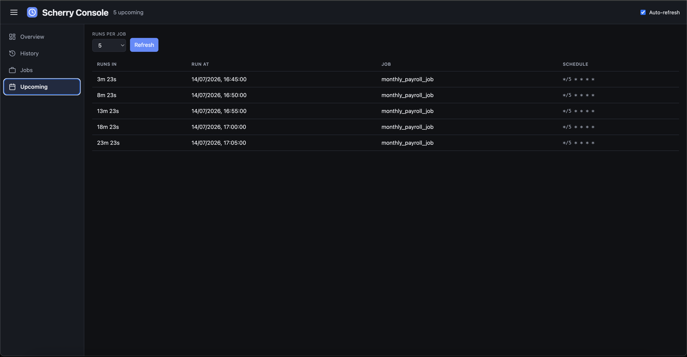

<div align="center">
<p align="center">
  <picture>
    
  </picture>
</p>

### **Track every job. Manage every lifecycle.**
### Better tracking and management of distributed job lifecycles — from web console.

---
<br/>

**scherry** is a production-ready **distributed job orchestration library** for Go that lets you split large workloads into parallel tasks, distribute them over Kafka, and track every job and task throughout its lifecycle.

Unlike single-level task queues that leave you guessing when a batch run stalls or fails, **scherry** gives you a two-level **job → task** model on top of [Asynq](https://github.com/hibiken/asynq): split work once, execute tasks in parallel, persist state at every step, and inspect progress, retries, and failures from a single UI.

<br/>


<br/>
</div>

---
<br/>

[](https://github.com/zepto-labs/scherry/actions/workflows/test.yml)

## Table of contents

- [How it builds on Asynq](#how-it-builds-on-asynq)
- [Feature comparison](#feature-comparison)
- [Architecture](#architecture)
- [Features](#features)
- [Install](#install)
- [Prerequisites](#prerequisites)
- [Configuration](./docs/CONFIGURATION.md)
- [Quick start](#quick-start)
  - [Scheduled job (cron-triggered)](#scheduled-job-cron-triggered)
  - [Manual job (on-demand trigger)](#manual-job-on-demand-trigger)
- [Sharing a consumer across jobs](#sharing-a-consumer-across-jobs)
- [Kafka tuning](#kafka-tuning)
  - [ConsumerConfig](#consumerconfig--kafkagoreaderconfig)
  - [WriterConfig](#writerconfig--kafkagowriter)
  - [TLS and SASL](#tls-and-sasl-eg-confluent-cloud-aws-msk)
- [History console](#history-console)
  - [Overview tab](#overview-tab)
  - [History tab](#history-tab)
  - [Jobs tab](#jobs-tab)
  - [Upcoming tab](#upcoming-tab)
- [Core interfaces](#core-interfaces)
  - [JobExecutor](#jobexecutor)
  - [TaskData](#taskdata)
  - [TaskExecutor](#taskexecutor)
- [Logger](#logger)
- [Hooks](#hooks)
- [Payroll example](#payroll-example)
- [Migrating an existing app](#migrating-an-existing-app)
- [Job lifecycle](#job-lifecycle)
- [Task lifecycle](#task-lifecycle)
- [API summary](#api-summary)
- [Contributing](#contributing)
- [Third-Party Licenses](#third-party-licenses)
- [License](#license)
- [Credits](#credits)

## How it builds on Asynq

[Asynq](https://github.com/hibiken/asynq) is a Redis-backed distributed task queue: you enqueue individual tasks, workers pick them up, and Asynq handles retries, priorities, and scheduling. It is excellent for simple background job processing.

**scherry** uses Asynq for one specific responsibility — **cron-based job triggering** — and then takes over for everything else:

| Responsibility | Technology |
|---|---|
| Scheduled job triggers (cron) | Asynq + Redis |
| Fan-out: splitting a job into parallel tasks | Kafka topics |
| Durable history: job and task state | PostgreSQL |
| Task retries with delay | Kafka retry topic |
| Dead-letter queue for exhausted tasks | Kafka DLQ topic |
| FSM-based lifecycle for jobs and tasks | Built-in state machine |
| History console and audit trail | Embedded web UI (Postgres-backed) |

The key additions over raw Asynq are:

- **Two-level job → task model** — A `JobExecutor` splits work into N tasks; a `TaskExecutor` handles one task. The library orchestrates splitting, persistence, fan-out, retries, and job finalization automatically.
- **Kafka fan-out for tasks** — Tasks are published to Kafka topics and consumed by scalable consumer groups, decoupling task throughput from the Redis-based job trigger layer.
- **Durable Postgres persistence** — Every job and task is written to partitioned `scherry_jobs` / `scherry_tasks` tables, giving you a reliable audit trail that survives Redis restarts.
- **FSM-based lifecycle** — Jobs and tasks move through an explicit finite-state machine (`PENDING` → `RUNNING` → `COMPLETED` / `FAILED` / etc.), with well-defined terminal states and automatic job finalization when all tasks settle.
- **Retry topic + DLQ** — Failed tasks are re-published to a dedicated retry topic (with configurable delay) rather than being held in Redis. Tasks that exhaust all retries are published to a DLQ topic for inspection.
- **Manual / on-demand jobs** — `RegisterManual` + `Trigger` lets you fire a job from an HTTP handler or event without a cron schedule.
- **Task distribution keys** — An optional Kafka partition key (`DistributionKey`) routes related tasks to the same partition/consumer, preserving ordering and enabling consumer affinity.
- **Idempotent execution** — `ExecuteJob` deduplicates runs by a caller-supplied `refID`, so firing a job twice is safe.
- **Execution hooks** — `OnTasksPublished`, `OnTaskStarted`, `OnTaskFinished`, `OnJobFinished` callbacks for Prometheus metrics or any custom instrumentation.
- **History console** — A built-in web UI served on its own port, backed by Postgres, showing job/task progress, timings, retry lineage, and a one-click retry action.

## Feature comparison

The table below compares **scherry** against Asynq (which it wraps) and four other commonly used Go job/task queue libraries.

| Feature | scherry | [asynq](https://github.com/hibiken/asynq) | [River](https://riverqueue.com) | [Machinery](https://github.com/RichardKnop/machinery) | [go-quartz](https://github.com/reugn/go-quartz) |
|---|---|---|---|---|---|
| **Task broker / backend** | Kafka + Redis | Redis | PostgreSQL | Redis / RabbitMQ / SQS | In-memory |
| **Durable job history** | PostgreSQL | Redis (volatile) | PostgreSQL | Broker-dependent | ✗ (custom JobQueue required) |
| **Two-level job → task model** | ✓ | ✗ | ✗ | Partial (chains/groups) | ✗ |
| **Kafka fan-out for tasks** | ✓ | ✗ | ✗ | ✗ | ✗ |
| **FSM-based lifecycle** | ✓ | ✗ | ✓ | ✗ | ✗ |
| **Cron / scheduled jobs** | ✓ | ✓ | ✓ | ✓ | ✓ |
| **Manual / on-demand trigger** | ✓ | ✓ | ✓ | ✓ | ✓ (RunOnceTrigger) |
| **Task retry with delay** | ✓ (retry topic) | ✓ | ✓ | ✓ | ✗ |
| **Dead-letter queue (DLQ)** | ✓ (DLQ topic) | ✓ | ✓ | ✓ | ✗ |
| **Task distribution / partition routing** | ✓ | ✗ | ✗ | ✗ | ✗ |
| **Automatic job finalization** | ✓ | ✗ | ✗ | Partial | ✗ |
| **Idempotent execution (dedup)** | ✓ (refID) | ✓ (unique option) | ✓ | ✗ | ✗ |
| **Execution result persistence** | ✓ (Postgres) | ✗ | ✓ | ✓ (backend) | ✗ |
| **Execution timing (start/finish/duration)** | ✓ | ✗ | ✓ | ✗ | ✗ |
| **Built-in history web UI** | ✓ | ✓ (asynqmon) | ✓ | ✗ | ✗ |
| **Instrumentation hooks** | ✓ | ✓ | ✓ | ✓ | ✗ |
| **Priority queues** | ✗ | ✓ | ✓ | ✗ | ✗ |
| **Workflow orchestration (DAG / chains)** | ✗ | ✗ | ✓ (Pro) | ✓ | ✗ |
| **Open source (free tier)** | ✓ | ✓ | ✓ (core) | ✓ | ✓ |

> **When to choose scherry:** if your workload involves large batch jobs (payroll runs, data exports, bulk notifications) that need to be split into thousands of parallel tasks, tracked durably in Postgres, retried reliably via Kafka, and inspected through a history UI — with the cron trigger layer staying lightweight on Redis.
>
> **When Asynq alone is enough:** for simple background task processing where a single-level queue over Redis is sufficient and you do not need durable Postgres history or Kafka-based fan-out.
>
> **When River fits better:** if your entire stack already relies on Postgres and you want transactional job enqueueing without a separate broker; River Pro is required for workflow orchestration and guaranteed sequential execution.
>
> **When Machinery fits better:** if you need broker flexibility (RabbitMQ, AWS SQS) or workflow primitives like chains and chords across a polyglot environment.
>
> **When go-quartz fits better:** if you need a lightweight, zero-dependency cron/interval scheduler with no external infrastructure; go-quartz is ideal for simple recurring tasks within a single process where durable history, fan-out, retries, and a broker are not required.

## Architecture



**Entry points**

| Path | How it starts |
|---|---|
| Scheduled job | Asynq cron fires at the configured schedule; calls `ExecuteJob` via the Asynq `ServeMux` handler |
| Manual / on-demand job | Your code calls `Trigger(ctx, name, refID, metadata)`; calls `ExecuteJob` directly |

**Retry and DLQ flow**

When `TaskExecutor.Execute` returns an error, the library checks the task's remaining retry count:

1. **Retries remaining** — the task status is reset to `PENDING` and the message is re-published to the dedicated **retry topic** after the configured `RetryDelay`. A separate retry consumer group picks it up and calls `ExecuteTask` again.
2. **No retries left** — the task transitions to `MAX_RETRIES_EXHAUSTED` and the message is published to the **DLQ topic** for offline inspection or manual replay. The task is not re-processed automatically.

**Job completion checks**

A job is finalized (`COMPLETED`, `PARTIAL_FAILED`, or `FAILED`) once every one of its tasks has reached a terminal state (`COMPLETED`, `MAX_RETRIES_EXHAUSTED`, `CANCELLED`, `REJECTED`). Rather than re-evaluating this after every single task completion, `JobConfig.JobCompletionCron` — a required cron expression — periodically batch-checks that job's `RUNNING` instances and finalizes any that are ready, the same way `Schedule` triggers a job's execution on a cron. `Register` and `RegisterManual` both reject a `JobConfig` that leaves `JobCompletionCron` empty. You can also call `Service.CheckJobCompletions(ctx, jobName)` directly (e.g. from your own scheduler or an admin action) whenever you want a check to run outside the configured cron. A job created with zero tasks is always finalized immediately, since there would otherwise be nothing to ever trigger it.

## Features

**Scheduling and triggering**
- **Cron-scheduled jobs** — `Register` with a cron expression; Asynq fires the job automatically at the configured schedule
- **Manual / on-demand jobs** — `RegisterManual` + `Trigger` to fire a job from an HTTP handler, event stream, or any programmatic call
- **`CancelPrevious`** — when enabled, starting a new run of a job automatically cancels any previous in-flight run of the same job
- **`Enabled` callback** — a per-job `func() bool` evaluated at execution time; returning `false` rejects the run without removing the registration

**Execution and fan-out**
- **Job → task splitting** — `JobExecutor.Execute` returns a `[]TaskData`; each item becomes one persisted task and one Kafka message
- **Parallel task execution** — tasks are consumed by a dedicated Kafka consumer group per job; task throughput scales independently of the Redis/Asynq layer
- **Idempotent execution** — `ExecuteJob` deduplicates by a caller-supplied `refID`; safe to call multiple times for the same logical run
- **Task distribution keys** — optional `DistributionKey` on each `TaskData` routes related tasks to the same Kafka partition, preserving ordering and enabling consumer affinity (e.g. all tasks for a given customer handled by one worker instance)
- **Shared consumers** — `RegisterShared` explicitly couples two or more jobs onto one Kafka consumer, one producer, and one `TaskExecutor` when you want to pool Kafka resources instead of running an isolated consumer per job (see [Sharing a consumer across jobs](#sharing-a-consumer-across-jobs))

**Reliability and retries**
- **Retry topic with delay** — on failure, tasks with retries remaining are re-published to a dedicated Kafka retry topic after the configured `RetryDelay`, then consumed and re-executed automatically
- **Dead-letter queue (DLQ)** — tasks that exhaust all retry attempts transition to `MAX_RETRIES_EXHAUSTED` and are published to a DLQ Kafka topic for offline inspection or manual replay
- **Programmatic job retry** — `RetryJob` clones a terminal job and re-queues its failed/exhausted tasks; `fullRetry: true` re-runs every task in the original job

**Observability**
- **Durable Postgres history** — every job and task is persisted to partitioned `scherry_jobs` / `scherry_tasks` tables, including execution timing (`started_at`, `finished_at`, `duration_ms`)
- **FSM-based lifecycle** — jobs and tasks move through an explicit finite-state machine with well-defined transitions; the library auto-finalizes a job once all its tasks reach a terminal state
- **Execution hooks** — `OnTasksPublished`, `OnTaskStarted`, `OnTaskFinished`, `OnJobFinished` callbacks for Prometheus metrics or any custom instrumentation
- **History console** — built-in web UI served on its own port, backed by Postgres; shows per-job progress, timings, retry lineage, and a one-click retry action

**Extensibility**
- **Pluggable transport** — inject custom `Publisher` and `MessageReader` implementations to replace the default kafka-go producer and consumer
- **Kafka tuning** — pass-through `ConsumerConfig` / `WriterConfig` for TLS, SASL, batching, compression, and all kafka-go producer/consumer knobs
- **Programmatic task queries** — `GetJobTasks` returns paginated, sequence-ordered tasks directly in Go without going through the HTTP console API

## Install

```bash
go get github.com/zepto-labs/scherry
```

## Prerequisites

- PostgreSQL with partitioned `scherry_jobs` and `scherry_tasks` tables
- Redis for Asynq scheduler/worker
- Kafka for task fan-out

Apply migrations from [`migrations/`](migrations/).

See [`docs/CONFIGURATION.md`](docs/CONFIGURATION.md) for the full bootstrap, job, and example environment variable reference.

## Quick start

### Scheduled job (cron-triggered)

```go
svc, err := scherry.New(scherry.Config{
    ServiceName: "my-service",
    Logger:      myLogger,              // required
    Hooks:       myHooks,               // optional instrumentation
    Redis:       scherry.RedisConfig{Addr: "localhost:6379"},
    Database:    scherry.DatabaseConfig{Host: "localhost", Port: 5432, User: "postgres", Password: "secret", DBName: "jobs"},
})

err = svc.Register(scherry.JobConfig{
    Name:              "my_job",
    JobExecutor:       myJobExecutor,
    TaskExecutor:      myTaskExecutor,
    Schedule:          "0 */4 * * *",
    JobCompletionCron: "*/2 * * * *", // check for completed jobs every 2 minutes
    Retry:             scherry.RetryConfig{MaxRetries: 3, RetryDelay: 5 * time.Minute},
    AsynqOptions:      []asynq.Option{asynq.MaxRetry(3)},
    Kafka: scherry.KafkaConfig{
        Brokers:        []string{"localhost:9092"},
        TaskTopic:      "my_job_tasks",
        TaskRetryTopic: "my_job_tasks_retry",
        TaskDLQTopic:   "my_job_tasks_dlq",
        ConsumerGroup:  "my_job_worker",
        // ConsumerConfig and WriterConfig are optional — see "Kafka tuning"
        // below for examples.
    },
})

mux := asynq.NewServeMux()
svc.Start(ctx, mux)

server := asynq.NewServer(redisCfg.AsynqClientOpt(), asynq.Config{Concurrency: 5})
server.Run(mux)
```

### Manual job (on-demand trigger)

Use `RegisterManual` for jobs that should only run when explicitly triggered (e.g. from an HTTP handler or event):

```go
err = svc.RegisterManual(scherry.JobConfig{
    Name:              "my_manual_job",
    JobExecutor:       myJobExecutor,
    TaskExecutor:      myTaskExecutor,
    Retry:             scherry.RetryConfig{MaxRetries: 3, RetryDelay: 5 * time.Minute},
    JobCompletionCron: "*/2 * * * *", // check for completed jobs every 2 minutes
    Kafka: scherry.KafkaConfig{
        Brokers:        []string{"localhost:9092"},
        TaskTopic:      "my_manual_job_tasks",
        TaskRetryTopic: "my_manual_job_tasks_retry",
        TaskDLQTopic:   "my_manual_job_tasks_dlq",
        ConsumerGroup:  "my_manual_job_worker",
    },
})

// Fire on demand — e.g. from an HTTP handler:
refID := uuid.New().String()
err = svc.Trigger(ctx, "my_manual_job", refID, map[string]interface{}{"key": "value"})
```

## Sharing a consumer across jobs

By default every registered job gets its own Kafka consumer (one reader goroutine and consumer group per job), which gives each job full isolation. When you have several jobs whose task volume is low, or where you would rather pool Kafka resources than isolate them, `RegisterShared` lets **two or more jobs share a single consumer, a single producer, and a single `TaskExecutor`**.

A common motivation is **limiting the load a job's consumer places on a downstream service**. Each consumer is an independent source of concurrent calls to whatever your `TaskExecutor` talks to (a database, a rate-limited third-party API, an internal microservice). Running a separate consumer per job multiplies that pressure — N jobs mean N sets of in-flight requests hitting the same downstream. Coupling related jobs onto one shared consumer collapses them into a single, bounded stream of task processing against that dependency, so you can size and rate-limit the downstream for one consumer instead of many.

Coupling is **explicit and only happens through `RegisterShared`** — reusing the same `ConsumerGroup`/topic on separate `Register`/`RegisterManual` calls does *not* couple jobs and is rejected, so you can never share a consumer by accident.

```go
err := svc.RegisterShared(scherry.SharedKafkaConfig{
    // One common Kafka config for every coupled job: brokers, topics,
    // consumer group, and consumer/writer tuning.
    Kafka: scherry.KafkaConfig{
        Brokers:        []string{"localhost:9092"},
        TaskTopic:      "billing_tasks",
        TaskRetryTopic: "billing_tasks_retry",
        TaskDLQTopic:   "billing_tasks_dlq",
        ConsumerGroup:  "billing_shared_worker",
    },
    // One shared TaskExecutor handles every task, regardless of which job
    // produced it (the consumer, and therefore its processing logic, is shared).
    TaskExecutor: billingTaskExecutor,
    // The coupled jobs. Each keeps its own trigger/split side; their Kafka and
    // TaskExecutor fields must be left empty (inherited from above).
    Jobs: []scherry.JobConfig{
        {
            Name:              "monthly_payroll_job",
            Schedule:          "0 */4 * * *",          // scheduled
            JobExecutor:       payrollExecutor,
            JobCompletionCron: "*/2 * * * *",
            Retry:             scherry.RetryConfig{MaxRetries: 3, RetryDelay: 5 * time.Minute},
        },
        {
            Name:              "bonus_payout_job",       // manual (no Schedule)
            JobExecutor:       bonusExecutor,
            JobCompletionCron: "*/2 * * * *",
            Retry:             scherry.RetryConfig{MaxRetries: 5, RetryDelay: time.Minute},
        },
    },
})
```

**What is shared vs. per-job**

| Shared (from `SharedKafkaConfig`) | Per-job (from each `JobConfig`) |
|---|---|
| Kafka brokers, task/retry/DLQ topics, consumer group | `Name` and durable job/task history |
| The Kafka consumer (one reader) and producer (one writer) | `JobExecutor` (how work is split into tasks) |
| `TaskExecutor` (how each task is processed) | `Schedule` (scheduled) or none (manual, via `Trigger`) |
| `ConsumerConfig` / `WriterConfig` tuning | `Retry` policy, `JobCompletionCron`, `CancelPrevious`, `Enabled`, `Hooks` |

Because task-to-job routing is resolved from Postgres (each consumed message is looked up by task ID), the single shared consumer dispatches every message to the correct job's lifecycle automatically — the jobs stay fully independent in history, scheduling, and retry policy.

**Requirements and validation.** `RegisterShared` requires at least two jobs, a non-empty `Kafka.Brokers`/`TaskTopic`/`ConsumerGroup`, a non-nil shared `TaskExecutor`, and a `JobCompletionCron` on every job. Each job's `Kafka`, `TaskExecutor`, `Publisher`, and reader fields must be left empty (they come from the shared config); setting any of them is a validation error.

**Trade-offs.** Sharing a consumer means the coupled jobs share a failure domain and throughput — you cannot scale one job's consumers independently, and because the retry consumer waits out a task's `RetryDelay` inline, a long delay on one job's task can hold up others on the same shared consumer. Prefer the default one-consumer-per-job when you need isolation; use `RegisterShared` when pooling Kafka consumer resources is the goal.

## Kafka tuning

`KafkaConfig` exposes two optional pass-through fields that map directly to the underlying kafka-go types. The five routing fields (`Brokers`, `TaskTopic`, `TaskRetryTopic`, `TaskDLQTopic`, `ConsumerGroup`) are always managed by the library. Everything else is forwarded verbatim to kafka-go, which applies **its own defaults** for any zero value. Retry policy (`MaxRetries`, `RetryDelay`) is configured together via `JobConfig.Retry` (a `RetryConfig`) rather than on `KafkaConfig` — see the Quick start examples above.

### ConsumerConfig — `kafkago.ReaderConfig`

Tunes both the main task consumer and the retry consumer. `Brokers`, `GroupID`, and `Topic` are set by the library and cannot be overridden here.

```go
import kafkago "github.com/segmentio/kafka-go"

Kafka: scherry.KafkaConfig{
    // ... routing fields ...
    ConsumerConfig: kafkago.ReaderConfig{
        MinBytes:       1_000,                  // wait for ≥ 1 KB per fetch
        MaxBytes:       5_000_000,              // cap fetch response at 5 MB
        MaxWait:        500 * time.Millisecond, // max broker wait per fetch
        SessionTimeout: 30 * time.Second,       // rebalance window
        CommitInterval: time.Second,            // periodic auto-commit; 0 = sync per message
        StartOffset:    kafkago.LastOffset,     // skip historical messages for new groups
    },
},
```

### WriterConfig — `*kafkago.Writer`

Controls the producer. The library sets `Addr` from `Brokers` when `Addr` is nil. All other fields are used as-is. When `WriterConfig` is nil, a writer is created with a `Hash` balancer (for `DistributionKey` routing) and kafka-go defaults.

```go
Kafka: scherry.KafkaConfig{
    // ... routing fields ...
    WriterConfig: &kafkago.Writer{
        Balancer:     &kafkago.Hash{},      // preserve DistributionKey routing
        RequiredAcks: kafkago.RequireAll,   // wait for all in-sync replica acks
        Compression:  kafkago.Zstd,        // compress batches
        BatchSize:    500,
        BatchTimeout: 5 * time.Millisecond,
    },
},
```

### TLS and SASL (e.g. Confluent Cloud, AWS MSK)

TLS and authentication are set via the native kafka-go fields inside `ConsumerConfig` and `WriterConfig`:

```go
import (
    kafkago  "github.com/segmentio/kafka-go"
    "github.com/segmentio/kafka-go/sasl/plain"
)

Kafka: scherry.KafkaConfig{
    // ... routing fields ...
    ConsumerConfig: kafkago.ReaderConfig{
        Dialer: &kafkago.Dialer{
            TLS:           tlsCfg,
            SASLMechanism: plain.Mechanism{Username: "key", Password: "secret"},
        },
    },
    WriterConfig: &kafkago.Writer{
        Transport: &kafkago.Transport{
            TLS:  tlsCfg,
            SASL: plain.Mechanism{Username: "key", Password: "secret"},
        },
    },
},
```

## History console

The built-in **history console** is a dark-themed web UI served on its own port. It is backed entirely by the persisted `scherry_jobs` / `scherry_tasks` Postgres tables and auto-refreshes every 5 seconds. It has four tabs.

Start it alongside your application:

```go
// Serve on its own port.
consoleServer, err := svc.StartConsole(":3002")
if err != nil {
    log.Fatal(err)
}
defer consoleServer.Shutdown(context.Background())
```

Or mount the handler under an existing mux (e.g. behind your own auth middleware):

```go
mux := http.NewServeMux()
mux.Handle("/console/", http.StripPrefix("/console", svc.ConsoleHandler()))
```

> **Security:** the console has **no built-in authentication**. Serve it on localhost during development, or protect it behind auth and network controls in production.

---

### Overview tab

The landing tab. Shows aggregate metrics across all registered jobs for a selectable time range (last 1 h / 24 h / 7 d / 30 d).

- **Job executions by status** — stacked bar chart with one bar per job, broken down by execution status (COMPLETED, PARTIAL_FAILED, FAILED, RUNNING, PENDING, CANCELLED, REJECTED). Hover a segment for exact counts. Click legend entries to toggle individual statuses.
- **Tasks over time** — line chart of task outcomes (Succeeded / Failed / Other) bucketed by hour or day, filterable by job. Hover the chart for per-bucket counts.
- **Jobs summary table** — one row per registered job showing next scheduled run countdown, average job duration, total success and error counts, and error rate.



---

### History tab

A paginated table of every job run, newest first. Filter by job name, execution status, reference ID (the caller-supplied `refID` used for idempotency/dedup — exact match), and page size.

Each row shows:
- Job name and a short job ID
- Status badge (color-coded)
- Progress bar segmented into completed (green) / failed (red) / running (amber) tasks, with a `done/total` label
- Start time and total duration

**Click any row** to open a slide-over detail drawer showing:
- Full job metadata: job ID, reference ID, parent job ID, start/finish timestamps, duration
- Expandable raw metadata JSON passed to the `JobExecutor`
- **Retry controls** — a "full retry" checkbox and a **Retry job** button (enabled only when the job is in a terminal state). Full retry re-runs every task; partial retry re-queues only `MAX_RETRIES_EXHAUSTED` tasks.
- **Retry lineage** — clickable links to every ancestor and descendant run in the retry chain
- Paginated task list with status filter, showing: sequence number, task name, status badge, attempt / max-retries, duration, and expandable result JSON



---

### Jobs tab

A static table of every job currently registered with the service — both scheduled and manual.

Columns: job name, cron schedule (blank for manual jobs), enabled status, max retries, cancel-previous flag, task topic, retry topic, DLQ topic, consumer group, and broker addresses.

Use this tab to verify that all jobs were registered with the expected Kafka and retry configuration.



---

### Upcoming tab

Shows the next N scheduled fires for each cron-scheduled job (configurable: 3 / 5 / 10 / 20 runs per job), computed from the registered cron expressions.

Columns: time until the run (relative, e.g. "4m 12s"), absolute run-at timestamp, job name, and schedule expression.

Manual jobs (`RegisterManual`) have no schedule and do not appear here.




## Core interfaces

### JobExecutor

Splits a scheduled job into independent tasks:

```go
type JobExecutor interface {
    Execute(ctx context.Context, metadata map[string]interface{}) ([]TaskData, error)
}
```

### TaskData

The unit returned by `JobExecutor.Execute`. Each element becomes one persisted task and one Kafka message:

```go
type TaskData struct {
    Name            string
    Params          map[string]interface{}
    DistributionKey string
}
```

**`DistributionKey`** is an optional Kafka partition key. When set, all tasks that share the same key are routed to the same Kafka partition, preserving relative ordering and enabling consumer affinity (e.g. all tasks for a given account always land on the same worker). When left empty, no message key is set and the producer distributes tasks round-robin across partitions.

Typical uses:
- **Customer/account isolation** — set `DistributionKey` to a customer ID so that all tasks for that customer are processed sequentially by one consumer instance.
- **Batch grouping** — set it to a batch identifier when the order of tasks within a batch matters.
- **Even distribution** — leave it empty (default) when tasks are independent and you want maximum parallelism.

### TaskExecutor

Runs a single task unit and returns an optional result payload that is persisted alongside the task record:

```go
type TaskExecutor interface {
    Execute(ctx context.Context, params map[string]interface{}) (map[string]interface{}, error)
}
```

## Logger

Implement `scherry.Logger` or use the built-in slog adapter:

```go
logger := scherry.NewSlogLogger(slog.Default())
```

## Hooks

All four hooks are optional. Unset hooks are silently no-ops.

| Hook | Fires when | Arguments |
|---|---|---|
| `OnTasksPublished` | All tasks for a job have been published to Kafka | `jobName string`, `count int` |
| `OnTaskStarted` | A task consumer picks up a message and begins executing | `jobName string`, `taskID string`, `attempt int` |
| `OnTaskFinished` | A task reaches a terminal state (any outcome) | `jobName string`, `taskID string`, `status string`, `duration time.Duration` |
| `OnJobFinished` | A job is finalized after all its tasks settle | `jobName string`, `refID string`, `status string`, `duration time.Duration` |

```go
hooks := scherry.Hooks{
    OnTasksPublished: func(ctx context.Context, jobName string, count int) {
        tasksPublished.WithLabelValues(jobName).Add(float64(count))
    },
    OnTaskStarted: func(ctx context.Context, jobName, taskID string, attempt int) {
        tasksInFlight.WithLabelValues(jobName).Inc()
    },
    OnTaskFinished: func(ctx context.Context, jobName, taskID, status string, d time.Duration) {
        tasksInFlight.WithLabelValues(jobName).Dec()
        taskDuration.WithLabelValues(jobName, status).Observe(d.Seconds())
    },
    OnJobFinished: func(ctx context.Context, jobName, refID, status string, d time.Duration) {
        jobDuration.WithLabelValues(jobName, status).Observe(d.Seconds())
    },
}
```

## Payroll example

See [`examples/payroll/`](examples/payroll/) for two jobs running side-by-side:

| Job | Kind | Trigger |
|---|---|---|
| `monthly_payroll_job` | `Register` (cron every 5 min) | Asynq scheduler fires automatically |
| `bonus_payout_job` | `RegisterManual` (no schedule) | `POST /bonus/trigger` HTTP endpoint |

- **payroll `JobExecutor`** loads employees and batches them into salary payout tasks
- **payroll `TaskExecutor`** simulates a bank transfer per batch
- **bonus `JobExecutor`** reads `bonus_pct` from metadata, batches employees
- **bonus `TaskExecutor`** computes and records a bonus transfer per employee
- **main.go** wires Kafka, Redis, Postgres, slog logger, hooks, and the history console

Run locally with Docker (applies migrations automatically):

```bash
cd examples/payroll
docker compose up -d --wait
go run .
```

Then open:
- [http://localhost:3002](http://localhost:3002) — history console (Postgres job/task history, progress, timings, retry)
- `POST http://localhost:8080/bonus/trigger` — fire an on-demand bonus payout

See [`examples/payroll/README.md`](examples/payroll/README.md) for the full walkthrough.

## Migrating an existing app

1. Add `scherry` as a dependency
2. Implement `JobExecutor` / `TaskExecutor` with your existing business logic
3. Inject Kafka, Redis, Postgres, Logger, and Hooks at bootstrap
4. Call `Register` instead of your in-app scheduler registration
5. Run Asynq worker with the mux returned from `Start`

Your app keeps ownership of SQL, metrics, and domain code — the library owns orchestration only.

## Job lifecycle

Jobs move through the FSM in [`internal/domain/state.go`](internal/domain/state.go):

| Status | When |
|---|---|
| `PENDING` | Job and tasks created |
| `RUNNING` | Tasks published to Kafka |
| `COMPLETED` | All tasks succeeded (or job had zero tasks) |
| `PARTIAL_FAILED` | All tasks finished with a mix of success and failure |
| `FAILED` | All tasks failed, or publish/split failed |
| `REJECTED` | Job registered with `Enabled: false` |
| `CANCELLED` | Superseded by a newer run when `CancelPrevious` is set |

A job with all tasks in a terminal state is finalized on the next `JobCompletionCron` tick (or immediately, for a job created with zero tasks). See [Job completion checks](#architecture) above. `RetryJob` requires the original job to be in a terminal state.

## Task lifecycle

Tasks move through the FSM in [`internal/domain/state.go`](internal/domain/state.go):

| Status | When |
|---|---|
| `PENDING` | Task created and published to Kafka, or reset for retry |
| `RUNNING` | Kafka consumer picked up the message and `TaskExecutor` is running |
| `COMPLETED` | `TaskExecutor` returned successfully |
| `FAILED` | Execution failed; may transition back to `PENDING` if retries remain |
| `MAX_RETRIES_EXHAUSTED` | All retry attempts used; task is sent to the DLQ topic |
| `REJECTED` | Parent job was rejected at registration |
| `CANCELLED` | Parent job was cancelled or superseded by `CancelPrevious` |

Typical happy path: `PENDING` → `RUNNING` → `COMPLETED`.

On failure with retries left: `RUNNING` → `FAILED` → `PENDING` (re-published to the retry topic with delay) → `RUNNING` → …

On failure with no retries left: `RUNNING` → `FAILED` → `MAX_RETRIES_EXHAUSTED` (published to DLQ).

Terminal task statuses (`COMPLETED`, `FAILED`, `MAX_RETRIES_EXHAUSTED`, `REJECTED`, `CANCELLED`) are used to determine when the parent job can be finalized.

Each task also carries a **`sequence_number`** — the 0-based index of the task in the `[]TaskData` slice originally returned by `JobExecutor.Execute`. Use it (or the `GetJobTasks` method) to retrieve tasks in generation order. See [Task ordering](#task-ordering) for why `created_at` is not reliable.

## API summary

| Method | Description |
|---|---|
| `New(Config)` | Create scheduler service |
| `Register(JobConfig)` | Register a cron-scheduled job with Kafka consumers and Asynq cron |
| `RegisterManual(JobConfig)` | Register a job with no schedule; trigger it programmatically via `Trigger` |
| `RegisterShared(SharedKafkaConfig)` | Register two or more jobs that explicitly share one Kafka consumer, producer, and `TaskExecutor` |
| `Trigger(ctx, name, refID, metadata)` | Programmatically fire a registered job (scheduled or manual) |
| `ExecuteJob(ctx, name, refID, metadata)` | Split job → tasks → persist → publish |
| `ExecuteTask(ctx, message)` | Process one Kafka task message |
| `RetryJob(ctx, jobID, fullRetry, refID)` | Clone and re-run failed/exhausted tasks |
| `CheckJobCompletions(ctx, jobName)` | Finalize jobName's `RUNNING` instances whose tasks are all terminal — the handler behind `JobCompletionCron`, callable directly on your own trigger |
| `GetJobTasks(ctx, TaskFilter)` | Paginated task list for a job, ordered by generation sequence |
| `Start(ctx, mux)` | Register Asynq handlers and start cron scheduler |
| `Stop()` | Stop consumers and scheduler |
| `ConsoleHandler()` | `http.Handler` for the job-history console UI + JSON API |
| `StartConsole(addr)` | Serve the console on its own port (e.g. `:3002`) |

## Contributing

See the [contributing guide](CONTRIBUTING.md) to learn how to contribute to the repository and the development workflow.

## Third-Party Licenses

This project depends on the following third-party packages. Their respective licenses apply to those packages.

### Direct dependencies

| Library | Version | License | License Changed? |
|---|---|---|---|
| [go-sqlmock](https://github.com/DATA-DOG/go-sqlmock) | v1.5.2 | [BSD-3-Clause](https://opensource.org/licenses/BSD-3-Clause) | No |
| [uuid](https://github.com/google/uuid) | v1.6.0 | [BSD-3-Clause](https://opensource.org/licenses/BSD-3-Clause) | No |
| [asynq](https://github.com/hibiken/asynq) | v0.24.1 | [MIT](https://opensource.org/licenses/MIT) | No |
| [pgtype](https://github.com/jackc/pgtype) | v1.14.4 | [MIT](https://opensource.org/licenses/MIT) | No |
| [pgx](https://github.com/jackc/pgx) | v5.7.4 | [MIT](https://opensource.org/licenses/MIT) | No |
| [fsm](https://github.com/looplab/fsm) | v1.0.3 | [Apache-2.0](https://opensource.org/licenses/Apache-2.0) | No |
| [cron](https://github.com/robfig/cron) | v3.0.1 | [MIT](https://opensource.org/licenses/MIT) | No |
| [kafka-go](https://github.com/segmentio/kafka-go) | v0.4.47 | [MIT](https://opensource.org/licenses/MIT) | No |
| [testify](https://github.com/stretchr/testify) | v1.10.0 | [MIT](https://opensource.org/licenses/MIT) | No |
| [postgres](https://gorm.io/driver/postgres) | v1.5.11 | [MIT](https://opensource.org/licenses/MIT) | No |
| [gorm](https://gorm.io/gorm) | v1.25.12 | [MIT](https://opensource.org/licenses/MIT) | No |

### Indirect dependencies

| Library | Version | License | License Changed? |
|---|---|---|---|
| [miniredis](https://github.com/alicebob/miniredis) | v2.38.0 | [MIT](https://opensource.org/licenses/MIT) | No |
| [ginkgo](https://github.com/bsm/ginkgo) | v2.12.0 | [MIT](https://opensource.org/licenses/MIT) | No |
| [gomega](https://github.com/bsm/gomega) | v1.27.10 | [MIT](https://opensource.org/licenses/MIT) | No |
| [toml](https://github.com/BurntSushi/toml) | v0.3.1 | [MIT](https://opensource.org/licenses/MIT) | No |
| [xxhash](https://github.com/cespare/xxhash) | v2.2.0 | [MIT](https://opensource.org/licenses/MIT) | No |
| [logex](https://github.com/chzyer/logex) | v1.1.10 | [MIT](https://github.com/chzyer/logex?tab=MIT-1-ov-file) | No |
| [readline](https://github.com/chzyer/readline) | v0.0.0-20180603132655-2972be24d48e | [MIT](https://opensource.org/licenses/MIT) | No |
| [test](https://github.com/chzyer/test) | v0.0.0-20180213035817-a1ea475d72b1 | [MIT](https://opensource.org/licenses/MIT) | No |
| [apd](https://github.com/cockroachdb/apd) | v1.1.0 | [Apache-2.0](https://opensource.org/licenses/Apache-2.0) | No |
| [go-systemd](https://github.com/coreos/go-systemd) | v0.0.0-20190719114852-fd7a80b32e1f | [Apache-2.0](https://opensource.org/licenses/Apache-2.0) | No |
| [pty](https://github.com/creack/pty) | v1.1.7 | [MIT](https://opensource.org/licenses/MIT) | No |
| [go-spew](https://github.com/davecgh/go-spew) | v1.1.1 | [ISC](https://opensource.org/licenses/ISC) | No |
| [go-rendezvous](https://github.com/dgryski/go-rendezvous) | v0.0.0-20200823014737-9f7001d12a5f | [MIT](https://opensource.org/licenses/MIT) | No |
| [quicktest](https://github.com/frankban/quicktest) | v1.14.6 | [MIT](https://opensource.org/licenses/MIT) | No |
| [log](https://github.com/go-kit/log) | v0.1.0 | [MIT](https://opensource.org/licenses/MIT) | No |
| [logfmt](https://github.com/go-logfmt/logfmt) | v0.5.0 | [MIT](https://opensource.org/licenses/MIT) | No |
| [stack](https://github.com/go-stack/stack) | v1.8.0 | [MIT](https://opensource.org/licenses/MIT) | No |
| [uuid](https://github.com/gofrs/uuid) | v4.0.0+incompatible | [MIT](https://opensource.org/licenses/MIT) | No |
| [protobuf](https://github.com/golang/protobuf) | v1.5.3 | [BSD-3-Clause](https://opensource.org/licenses/BSD-3-Clause) | No |
| [go-cmp](https://github.com/google/go-cmp) | v0.5.9 | [BSD-3-Clause](https://opensource.org/licenses/BSD-3-Clause) | No |
| [renameio](https://github.com/google/renameio) | v0.1.0 | [Apache-2.0](https://opensource.org/licenses/Apache-2.0) | No |
| [chunkreader](https://github.com/jackc/chunkreader) | v1.0.0 | [MIT](https://opensource.org/licenses/MIT) | No |
| [chunkreader](https://github.com/jackc/chunkreader) | v2.0.1 | [MIT](https://opensource.org/licenses/MIT) | No |
| [pgconn](https://github.com/jackc/pgconn) | v1.14.3 | [MIT](https://opensource.org/licenses/MIT) | No |
| [pgio](https://github.com/jackc/pgio) | v1.0.0 | [MIT](https://opensource.org/licenses/MIT) | No |
| [pgmock](https://github.com/jackc/pgmock) | v0.0.0-20210724152146-4ad1a8207f65 | [MIT](https://opensource.org/licenses/MIT) | No |
| [pgpassfile](https://github.com/jackc/pgpassfile) | v1.0.0 | [MIT](https://opensource.org/licenses/MIT) | No |
| [pgproto3](https://github.com/jackc/pgproto3) | v1.1.0 | [MIT](https://opensource.org/licenses/MIT) | No |
| [pgproto3](https://github.com/jackc/pgproto3) | v2.3.3 | [MIT](https://opensource.org/licenses/MIT) | No |
| [pgservicefile](https://github.com/jackc/pgservicefile) | v0.0.0-20240606120523-5a60cdf6a761 | [MIT](https://opensource.org/licenses/MIT) | No |
| [pgx](https://github.com/jackc/pgx) | v4.18.2 | [MIT](https://opensource.org/licenses/MIT) | No |
| [puddle](https://github.com/jackc/puddle) | v1.3.0 | [MIT](https://opensource.org/licenses/MIT) | No |
| [puddle](https://github.com/jackc/puddle) | v2.2.2 | [MIT](https://opensource.org/licenses/MIT) | No |
| [inflection](https://github.com/jinzhu/inflection) | v1.0.0 | [MIT](https://opensource.org/licenses/MIT) | No |
| [now](https://github.com/jinzhu/now) | v1.1.5 | [MIT](https://opensource.org/licenses/MIT) | No |
| [gotool](https://github.com/kisielk/gotool) | v1.0.0 | [MIT](https://opensource.org/licenses/MIT) | No |
| [sqlstruct](https://github.com/kisielk/sqlstruct) | v0.0.0-20201105191214-5f3e10d3ab46 | [MIT](https://opensource.org/licenses/MIT) | No |
| [compress](https://github.com/klauspost/compress) | v1.15.9 | [Apache-2.0](https://opensource.org/licenses/Apache-2.0) | No |
| [go-windows-terminal-sequences](https://github.com/konsorten/go-windows-terminal-sequences) | v1.0.2 | [MIT](https://opensource.org/licenses/MIT) | No |
| [pretty](https://github.com/kr/pretty) | v0.3.1 | [MIT](https://opensource.org/licenses/MIT) | No |
| [pty](https://github.com/kr/pty) | v1.1.8 | [MIT](https://opensource.org/licenses/MIT) | No |
| [text](https://github.com/kr/text) | v0.2.0 | [MIT](https://opensource.org/licenses/MIT) | No |
| [pq](https://github.com/lib/pq) | v1.10.2 | [MIT](https://opensource.org/licenses/MIT) | No |
| [semver](https://github.com/Masterminds/semver) | v3.1.1 | [MIT](https://opensource.org/licenses/MIT) | No |
| [go-colorable](https://github.com/mattn/go-colorable) | v0.1.6 | [MIT](https://opensource.org/licenses/MIT) | No |
| [go-isatty](https://github.com/mattn/go-isatty) | v0.0.12 | [MIT](https://opensource.org/licenses/MIT) | No |
| [lz4](https://github.com/pierrec/lz4) | v4.1.15 | [BSD-3-Clause](https://opensource.org/licenses/BSD-3-Clause) | No |
| [errors](https://github.com/pkg/errors) | v0.8.1 | [BSD-3-Clause](https://opensource.org/licenses/BSD-3-Clause) | No |
| [go-difflib](https://github.com/pmezard/go-difflib) | v1.0.0 | [BSD-3-Clause](https://opensource.org/licenses/BSD-3-Clause) | No |
| [go-redis](https://github.com/redis/go-redis) | v9.7.0 | [BSD-3-Clause](https://opensource.org/licenses/BSD-3-Clause) | No |
| [go-internal](https://github.com/rogpeppe/go-internal) | v1.9.0 | [BSD-3-Clause](https://opensource.org/licenses/BSD-3-Clause) | No |
| [xid](https://github.com/rs/xid) | v1.2.1 | [MIT](https://opensource.org/licenses/MIT) | No |
| [zerolog](https://github.com/rs/zerolog) | v1.15.0 | [MIT](https://opensource.org/licenses/MIT) | No |
| [go.uuid](https://github.com/satori/go.uuid) | v1.2.0 | [MIT](https://opensource.org/licenses/MIT) | No |
| [decimal](https://github.com/shopspring/decimal) | v1.2.0 | [MIT](https://opensource.org/licenses/MIT) | No |
| [logrus](https://github.com/sirupsen/logrus) | v1.4.2 | [MIT](https://opensource.org/licenses/MIT) | No |
| [cast](https://github.com/spf13/cast) | v1.7.0 | [MIT](https://opensource.org/licenses/MIT) | No |
| [objx](https://github.com/stretchr/objx) | v0.5.2 | [MIT](https://opensource.org/licenses/MIT) | No |
| [pbkdf2](https://github.com/xdg-go/pbkdf2) | v1.0.0 | [Apache-2.0](https://opensource.org/licenses/Apache-2.0) | No |
| [scram](https://github.com/xdg-go/scram) | v1.1.2 | [Apache-2.0](https://opensource.org/licenses/Apache-2.0) | No |
| [stringprep](https://github.com/xdg-go/stringprep) | v1.0.4 | [Apache-2.0](https://opensource.org/licenses/Apache-2.0) | No |
| [goldmark](https://github.com/yuin/goldmark) | v1.4.13 | [MIT](https://opensource.org/licenses/MIT) | No |
| [gopher-lua](https://github.com/yuin/gopher-lua) | v1.1.1 | [MIT](https://opensource.org/licenses/MIT) | No |
| [goji](https://github.com/zenazn/goji) | v0.9.0 | [MIT](https://opensource.org/licenses/MIT) | No |
| [atomic](https://go.uber.org/atomic) | v1.6.0 | [MIT](https://opensource.org/licenses/MIT) | No |
| [goleak](https://go.uber.org/goleak) | v1.1.12 | [MIT](https://opensource.org/licenses/MIT) | No |
| [multierr](https://go.uber.org/multierr) | v1.5.0 | [MIT](https://opensource.org/licenses/MIT) | No |
| [tools](https://go.uber.org/tools) | v0.0.0-20190618225709-2cfd321de3ee | [MIT](https://opensource.org/licenses/MIT) | No |
| [zap](https://go.uber.org/zap) | v1.13.0 | [MIT](https://opensource.org/licenses/MIT) | No |
| [crypto](https://golang.org/x/crypto) | v0.31.0 | [BSD-3-Clause](https://opensource.org/licenses/BSD-3-Clause) | No |
| [lint](https://golang.org/x/lint) | v0.0.0-20190930215403-16217165b5de | [BSD-3-Clause](https://opensource.org/licenses/BSD-3-Clause) | No |
| [mod](https://golang.org/x/mod) | v0.17.0 | [BSD-3-Clause](https://opensource.org/licenses/BSD-3-Clause) | No |
| [net](https://golang.org/x/net) | v0.21.0 | [BSD-3-Clause](https://opensource.org/licenses/BSD-3-Clause) | No |
| [sync](https://golang.org/x/sync) | v0.10.0 | [BSD-3-Clause](https://opensource.org/licenses/BSD-3-Clause) | No |
| [sys](https://golang.org/x/sys) | v0.28.0 | [BSD-3-Clause](https://opensource.org/licenses/BSD-3-Clause) | No |
| [term](https://golang.org/x/term) | v0.27.0 | [BSD-3-Clause](https://opensource.org/licenses/BSD-3-Clause) | No |
| [text](https://golang.org/x/text) | v0.21.0 | [BSD-3-Clause](https://opensource.org/licenses/BSD-3-Clause) | No |
| [time](https://golang.org/x/time) | v0.8.0 | [BSD-3-Clause](https://opensource.org/licenses/BSD-3-Clause) | No |
| [tools](https://golang.org/x/tools) | v0.21.1-0.20240508182429-e35e4ccd0d2d | [BSD-3-Clause](https://opensource.org/licenses/BSD-3-Clause) | No |
| [xerrors](https://golang.org/x/xerrors) | v0.0.0-20200804184101-5ec99f83aff1 | [BSD-3-Clause](https://opensource.org/licenses/BSD-3-Clause) | No |
| [protobuf](https://google.golang.org/protobuf) | v1.35.2 | [BSD-3-Clause](https://opensource.org/licenses/BSD-3-Clause) | No |
| [check](https://gopkg.in/check.v1) | v1.0.0-20201130134442-10cb98267c6c | [BSD-3-Clause](https://opensource.org/licenses/BSD-3-Clause) | No |
| [errgo](https://gopkg.in/errgo.v2) | v2.1.0 | [BSD-3-Clause](https://opensource.org/licenses/BSD-3-Clause) | No |
| [inconshreveable](https://gopkg.in/inconshreveable/log15.v2) | v2.0.0-20180818164646-67afb5ed74ec | [Apache-2.0](https://opensource.org/licenses/Apache-2.0) | No |
| [yaml](https://gopkg.in/yaml.v2) | v2.2.2 | [Apache-2.0](https://opensource.org/licenses/Apache-2.0) | No |
| [yaml](https://gopkg.in/yaml.v3) | v3.0.1 | [MIT](https://opensource.org/licenses/MIT) | No |
| [tools](https://honnef.co/go/tools) | v0.0.1-2019.2.3 | [MIT](https://opensource.org/licenses/MIT) | No |


## Credits

- [Agnish Upadhyay](https://www.linkedin.com/in/agnish123/)
- [Shobhit Agarwal](https://www.linkedin.com/in/shobhitagarwal9506/)
- [Kundini Kamat](https://www.linkedin.com/in/kundinikamat/)
- [Shivam Singhal](https://www.linkedin.com/in/shivam-singhal-07a58275/)


### Special Thanks

- [Koushik Kottamasu](https://www.linkedin.com/in/koushik-kottamasu-b484b6101/)
- [Nikhil Mittal](https://www.linkedin.com/in/nikhilkmittal/)
